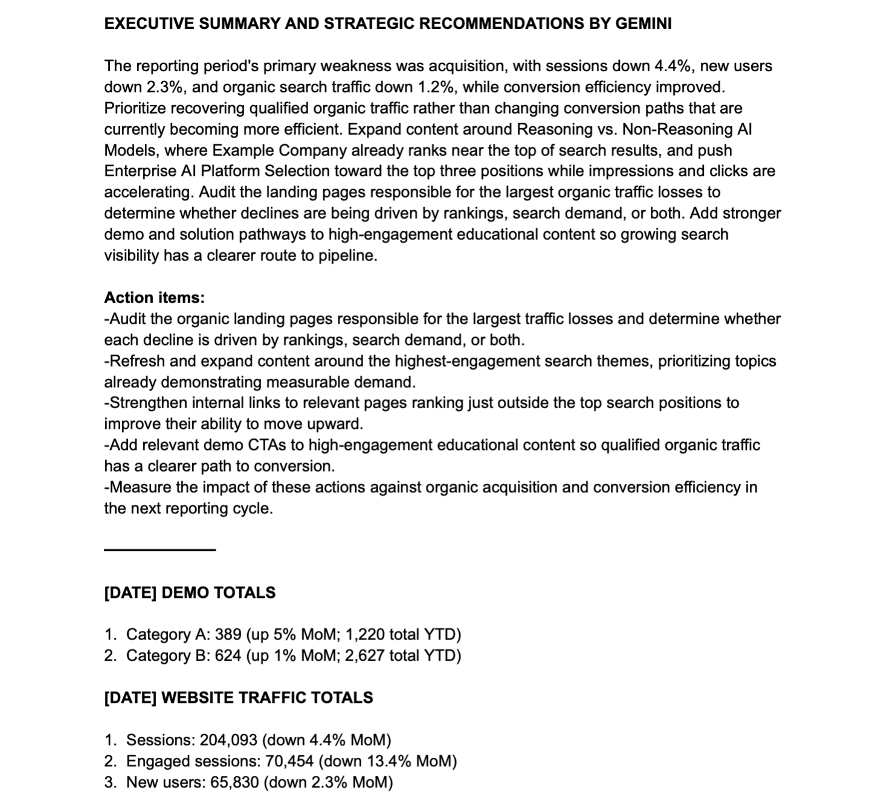
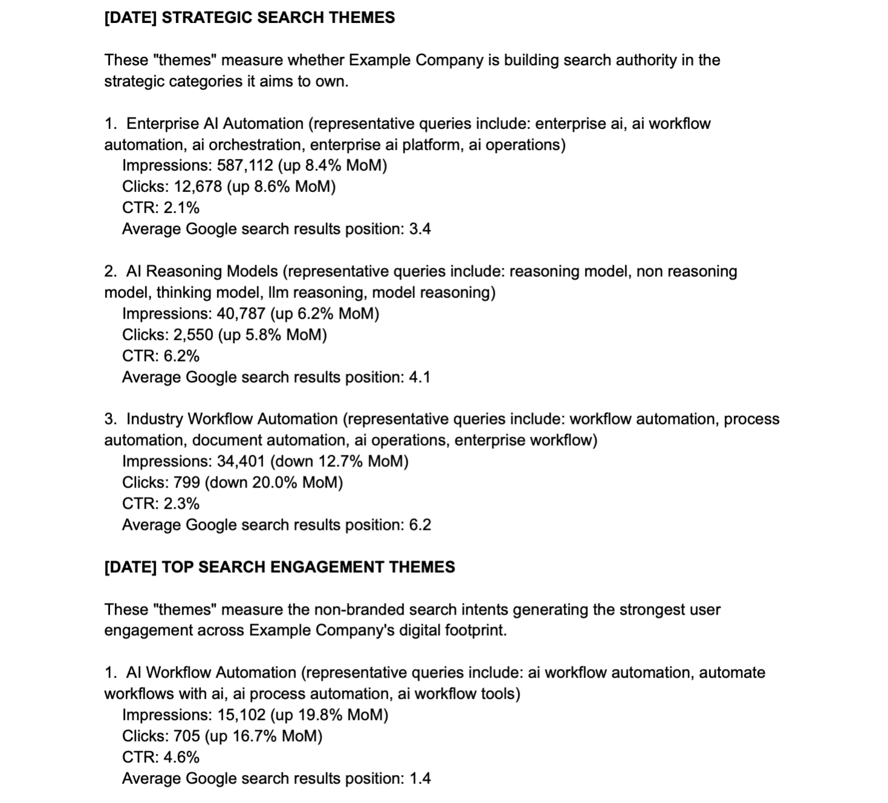

# AI-Powered Marketing Intelligence

An automated marketing intelligence workflow that turns fragmented performance, conversion, acquisition, and search data into executive insights and strategic recommendations.

This project was designed to solve a common marketing problem: critical signals often live across separate workflows, arrive on different schedules, and require manual interpretation before leadership can act. The workflow consolidates those inputs, calculates deterministic performance metrics, identifies emerging search intent, uses Gemini for semantic analysis and executive synthesis, and publishes a structured monthly report to Google Chat.

## Why this project exists

Marketing reporting is often descriptive. It shows what happened, but leaves the interpretation and prioritization to a human analyst.

this workflow goes further by automating the full monthly intelligence workflow:

1. Retrieve business and marketing performance data.
2. Calculate month-over-month changes and conversion-efficiency metrics.
3. Analyze Google Search Console visibility and engagement.
4. Dynamically group related search queries by underlying user intent.
5. Generate an executive summary and strategic recommendations with Gemini.
6. Publish the final report automatically to Google Chat.

The deterministic calculations remain in code. Gemini is used only where semantic interpretation adds value.

## Key capabilities

- Automated monthly marketing performance reporting
- Demo and conversion tracking
- GA4 traffic and acquisition analysis
- Google Search Console query analysis
- Month-over-month comparisons
- Year-to-date performance tracking
- Conversion-efficiency ratios
- Strategic search-theme monitoring
- Dynamic search-intent grouping with Gemini
- Executive summaries and strategic recommendations
- Gemini model fallback handling
- Graceful error reporting
- Automated Google Chat publishing
- Credential isolation through Apps Script Script Properties

## workflow architecture

```text
Business / Conversion Data
            +
           GA4
            +
 Google Search Console
            |
            v
  Google Apps Script
            |
            +--> Deterministic metric calculations
            |
            +--> Strategic search-theme analysis
            |
            +--> Gemini semantic query grouping
            |
            +--> Aggregated engagement-theme metrics
            |
            +--> Gemini executive synthesis
            |
            v
      Google Chat Report
```

The sequencing matters. Search-engagement themes are generated before the executive summary so the final AI analysis has access to the completed semantic grouping.

## AI design

Gemini performs two separate tasks.

### 1. Search-intent grouping

The script selects high-engagement, non-branded search queries and asks Gemini to group semantically similar queries into shared intent themes.

For example:

```text
reasoning llm vs non reasoning llm
reasoning models vs non reasoning models
thinking vs non thinking models
```

the reporting period be consolidated into a single theme such as:

```text
AI Reasoning Models
```

Apps Script then aggregates the metrics for every query in that theme. Gemini does not calculate the numbers.

### 2. Executive analysis

After all deterministic sections and search-intent themes are available, Gemini receives a compact context containing the completed performance signals.

It generates:

- an executive summary
- strategic recommendations

If Gemini cannot complete the request, the deterministic report still publishes and includes the raw API error for debugging.

## Example report structure

```text
EXECUTIVE SUMMARY AND STRATEGIC RECOMMENDATIONS BY GEMINI

[AI-generated executive analysis]

━━━━━━━

MONTH YYYY DEMO TOTALS

1. Category A: ...
2. Category B: ...

MONTH YYYY WEBSITE TRAFFIC TOTALS

1. Sessions: ...
2. Engaged sessions: ...
3. New users: ...
...

MONTH YYYY WEBSITE PERFORMANCE

1. Demo conversion ratio: ...
2. Demo acquisition efficiency ratio: ...
3. New-to-returning user ratio: ...

MONTH YYYY STRATEGIC SEARCH THEMES

[Configured strategic search themes and metrics]

MONTH YYYY TOP SEARCH ENGAGEMENT THEMES

[Dynamically generated search-intent themes and aggregated metrics]
```

## Technology stack

- Google Apps Script
- Google Analytics Data API / GA4
- Google Search Console API
- Gemini API
- Google Chat webhooks
- REST APIs
- JavaScript

## Reliability and failure handling

The workflow is designed so AI failures do not block the underlying marketing report.

Examples include:

- Gemini model fallback logic
- API response validation
- raw Gemini error reporting
- deterministic metrics independent of LLM output
- safe handling of missing comparison values
- explicit treatment of newly appearing search queries

## Security design

This public repository contains no real company credentials.

Secrets should be stored in **Apps Script Script Properties**, not committed to source control.

Recommended properties:

```text
GEMINI_API_KEY
GOOGLE_CHAT_WEBHOOK
PREVIOUS_MONTH_BOOKINGS_URL
```

Never commit:

- API keys
- Google Chat webhook URLs
- access tokens
- private endpoint credentials
- customer data
- internal company domains
- personally identifiable information

## Configuration

Before running the script:

1. Create a Google Apps Script project.
2. Copy `Code.gs` into the project.
3. Replace `Example Company` and the sample search themes with your own configuration.
4. Add the required Script Properties in **Project Settings**.
5. Configure your GA4 property and Search Console site.
6. Enable the Google APIs required by your implementation.
7. Run the main report function once and approve the requested permissions.
8. Confirm the report publishes correctly to Google Chat.
9. Add a time-driven Apps Script trigger for monthly automation.

## Anonymization

This repository is a portfolio-safe version of a real marketing intelligence workflow.

Company names, domains, strategic search themes, endpoints, property IDs, credentials, and business-specific conversion categories have been replaced with fictional examples or placeholders such as Category A and Category B. The architecture and implementation patterns are preserved.

## What this project demonstrates

From a marketing perspective:

- performance measurement
- acquisition analysis
- conversion-efficiency analysis
- search-demand intelligence
- executive reporting
- strategic recommendation generation

From a technical perspective:

- API integration
- automation design
- deterministic analytics
- LLM orchestration
- semantic classification
- failure handling
- credential management
- scheduled workflow execution

The intent is to demonstrate how marketing strategy, analytics, automation, and applied AI can be combined into a single operating workflow for recurring decision support.
